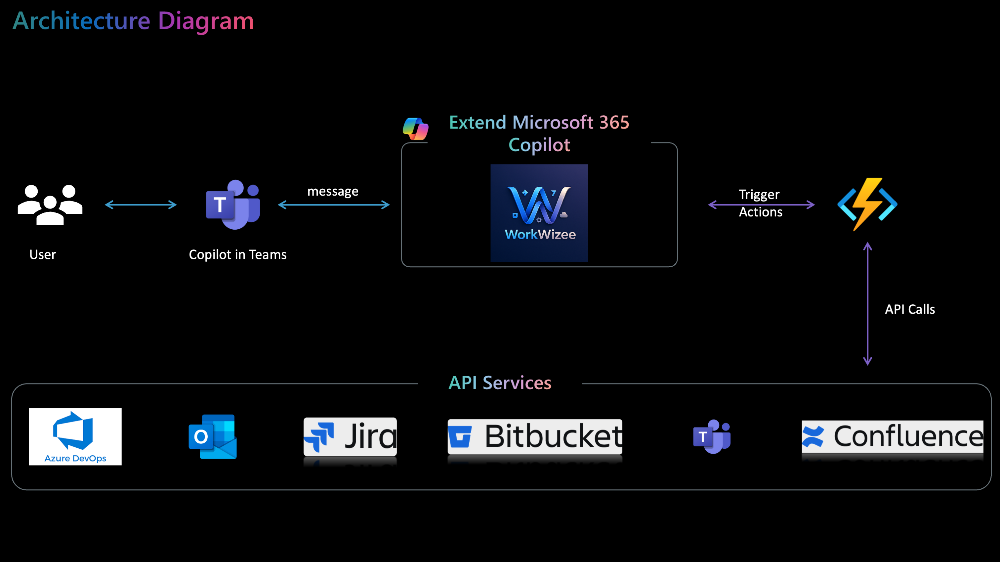

# WorkWizee AI Agent

## Table of Content

- [Inspiration](#inspiration)
- [Architecture](#architecture)
- [Video Demo](#video-demo)
- [What it does](#what-it-does)
  - [Teams](#teams)
  - [Jira](#jira)
  - [Bitbucket](#bitbucket)
- [How we built it](#how-we-built-it)
  - [Serverless Endpoints](#serverless-endpoints)
- [How To Test and Deploy](#how-to-test-and-deploy)

## Inspiration
Having been on multiple P1/P2 calls to solve data pipeline bugs. I understand the pain a development team has to go through, and it gets worse if you're new to the team. Let's create a process that makes this pain easier to navigate. Put agents to work and get the annoying things out of the way so you can focus on resolving the bugs ASAP. You know, once you start the P1/P2 calls, you need to update many things: ServiceNow ticket, Jira ticket, your manager, team lead, team members, and so on..
Finally, send out an RCA mail and create a Confluence page for the issue. What if we can make it all happen just by using an agent and from the comfort of Teams? That's where WorkWizee helps you and your team to **save 40% of your time**.

## Architecture



## Video Demo

[Click here to watch it 🎥](https://youtu.be/GbkObg_9qHM)

## What it does

It can help in these different scenarios.

All these from just natural language, just type `Add the work flow is working now comment to WOWZEE-12 jira ticket` like talking to your colleague. 


> **Adaptive cards are too old fashion.** 😬

The agent will process this information, extract the comment text from this and make the API call.

We'll see this in action in the demo video.

The following are the features you can use,

### Teams

1. Create group with active users *
2. Send reminder message to multiple users
3. Send message to a particular DRs

### Jira

1. Create Jira ticket and dynamically assign it to a user *
2. Comment on a Jira ticket
3. Get the latest comment from Jira

### Bitbucket

1. Create a PR from user branch to dev, stg, prod
2. Get current open PR based on priority *
3. Comment on a PR and notify user via Teams


## How we built it

- Copilot Studio - for building up the bot, topics, custom actions
- Python - for building the backend APIs
- Azure Functions - hosting the backend APIs at scale and cheaper
- Jira API - for all the interactions with Jira tickets
- BitBucket API - for all the interactions with the repo and PRs
- Confluence API - for all the interactions with pages
- Outlook API - for all the interactions with mail

### Serverless Endpoints

#### Jira

- /api/jira_add_comment
- /api/jira_create_ticket
- /api/jira_get_latest_comments

#### Bitbucket

- /api/bitbucket_create_pr
- /api/bitbucket_get_open_pr
- /api/bitbucket_comment_on_pr

#### Outlook

- /api/outlook_send_mail
- /api/outlook_book_meeting_room
- /api/outlook_search_mail

Pending integrations with below,

- Confluence
- Jenkins
- Azure Devops
- Azure Boards
- ServiceNow


## How To Test and Deploy

### Testing the Application

1. **Install Dependencies**  
   Ensure you have all the required dependencies installed by running:
   ```bash
   pip install -r requirements.txt
   ```

2. **Run Unit Tests**  
   Use `pytest` to run the unit tests:
   ```bash
   pytest
   ```

3. **Run Security Tests**  
   Use `bandit` to perform security checks on your Python code:
   ```bash
   bandit -r .
   ```

### Deploying the Application

1. **Login to Azure**  
   Authenticate with Azure CLI:
   ```bash
   az login
   ```

2. **Initialize Azure Function App**  
   Ensure your Azure Function app is created. If not, create one:
   ```bash
   az functionapp create --resource-group <RESOURCE_GROUP> --consumption-plan-location <LOCATION> --runtime python --runtime-version 3.9 --functions-version 4 --name <FUNCTION_APP_NAME> --storage-account <STORAGE_ACCOUNT>
   ```

3. **Deploy the Application**  
   Use the Azure Functions Core Tools to deploy:
   ```bash
   func azure functionapp publish <FUNCTION_APP_NAME>
   ```

4. **Verify Deployment**  
   Navigate to the Azure Portal and test the deployed endpoints.


or press `CMD + Shift + P` and search for `Deploy Azure Function`

Choose the Azure Function App name that you want to deploy to.

Note: It will overwrite the existing deployment.